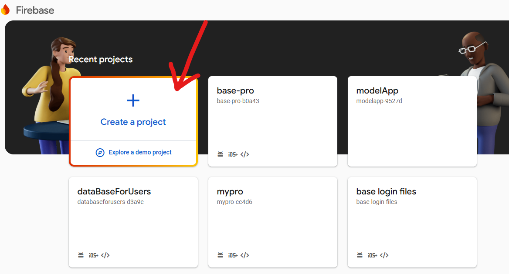
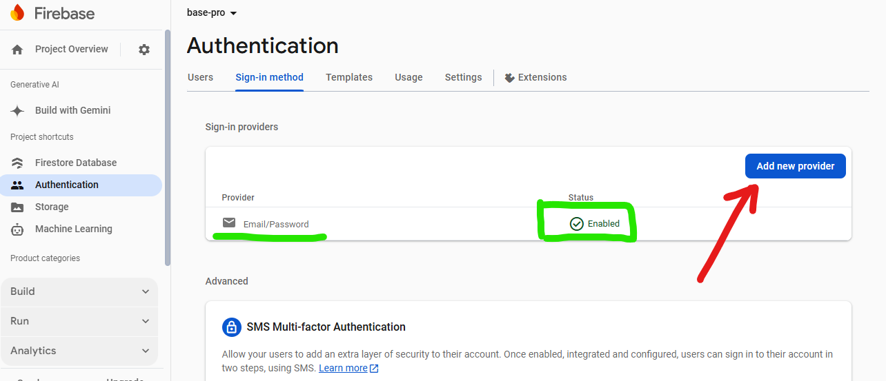
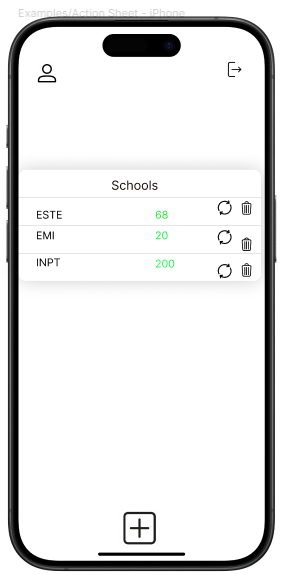

# PickSchool Project 
[![LinkedIn][linkedin-shield]][linkedin-url] 
 

 

 ## About project
 </img>

The purpose of this initiative is to help students forecast their likelihood of being accepted into a specific school. The approach helps students make decisions by giving them insights into their chances of admission through the analysis of multiple criteria and factors. 

## Project objective
In the modern workplace, educational approaches are vital in determining one's professional path. As a result, selecting a college to continue your education after high school is crucial. Our project's objective is to assist you in estimating the probability that you will be admitted to the school of your choice. Furthermore, our research will offer tailored suggestions regarding the best educational institution for every student to attend.
### connection ro the database --firebase 
You should create a new account on Firebase <a href="https://firebase.google.com/"> Firebase Official Website  </a>and create a database by giving all the information that is required.

you should enable the tool to use for my case i am using the email process

>> firebase login
the result must be that your are login successfully and the email that you have register with will appeare on the console
you should also download the cli  and execute this commande 
>> dart pub global activate flutterfire_cli
>> flutterfire configure
>> flutter pub add firebase_core
once you execute this commande  succesful you will find the  firebase_core library in the pubsbec.yaml file with the version.

#  Figma_app
  
  
  

## Documentation 
flutter <a href="https://docs.flutter.dev/"> documentation </a>  
dart <a href="https://dart.dev/guides"> documentation </a>  
firebase <a href="https://docs.flutter.dev/data-and-backend/firebase"> documentation </a>  
lottie <a href="https://pub.dev/packages/lottie"> documentation </a>  

## Application Stucture 
   
 

### 🌐 Find Me Around the Web 
- **Fiverr:** <a href="https://fr.fiverr.com/fatiha_laa?up_rollout=true"> Fiverr</a>
- **Email:** <a href="laaouafifatiha@gmail.com"> laaouafifatiha@gmail.com </a>
- **LinkedIn:** <a href="https://www.linkedin.com/in/fatiha-laaouafi-4227252ba/"> Linkdin </a>

## To use this project 

#### Installation
- install Flutter <a href = "https://docs.flutter.dev/get-started/install"> Install Now</a>
- install Git  <a href = "https://gitforwindows.org/">  for Windows </a>
- install Android Studio <a href = "https://developer.android.com/studio/install#windows"> Install Now</a>

<!-- MARKDOWN LINKS & IMAGES -->

[linkedin-shield]: https://img.shields.io/badge/-LinkedIn-black.svg?style=for-the-badge&logo=linkedin&colorB=555
[linkedin-url]:https://www.linkedin.com/in/fatiha-laaouafi-4227252ba/

